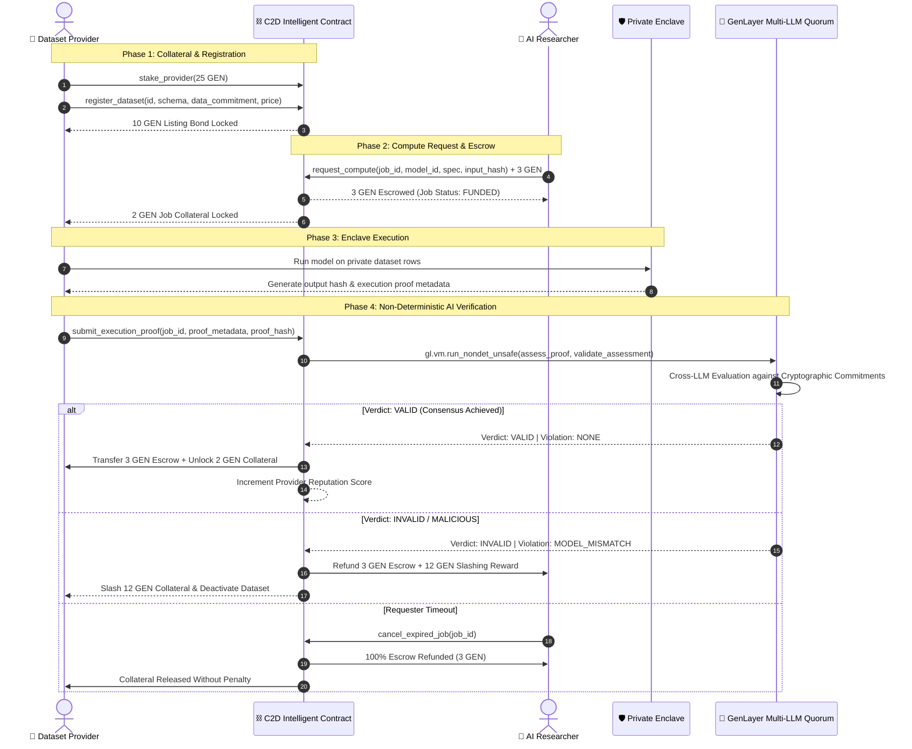

# 🌱 Compute2Data: Autonomous Privacy-Preserving AI Compute Marketplace on GenLayer

<p align="center">
  
  
  
  
  
  
  
</p>

---

## 📖 Table of Contents
1. [Executive Summary & Problem Statement](#-executive-summary--problem-statement)
2. [How It Works: Architectural Overview](#-how-it-works-architectural-overview)
3. [Intelligent Contract Deep Dive (v2.0)](#-intelligent-contract-deep-dive-v20)
4. [Spec-Driven Development (GitHub Spec Kit)](#-spec-driven-development-github-spec-kit)
5. [Live On-Chain Deployment & Proofs](#-live-on-chain-deployment--proofs)
6. [Step-by-Step Developer Quickstart](#-step-by-step-developer-quickstart)
7. [Mathematical Models & Slashing Economics](#-mathematical-models--slashing-economics)
8. [Security & Prompt Injection Defenses](#-security--prompt-injection-defenses)
9. [Project Structure](#-project-structure)
10. [Authors & Community](#-authors--community)

---

## 💡 Executive Summary & Problem Statement

### The Privacy-Compute Bottleneck
High-utility enterprise datasets (e.g., electronic health records, genomic biobanks, financial transaction graphs, satellite imagery) are trapped in isolated institutional silos. Dataset owners cannot publicly share raw data due to:
- Strict regulatory penalties (HIPAA, GDPR, CCPA).
- Intellectual property and trade secret exposure.
- Lack of verifiable trust in decentralized execution.

### The Compute2Dataata Paradigm
**Compute2Dataata** fundamentally solves this through **GenLayer Intelligent Contracts**:
- **Zero Raw Data Exposure**: Models travel to the data enclave, not the other way around.
- **Cryptographic Data Commitments**: Dataset providers lock GEN collateral and register immutable SHA-256 data schemas.
- **Automated Escrow Protocol**: Researchers fund compute jobs with zero gas fees on GenLayer StudioNet.
- **Autonomous Multi-LLM Quorum Verification**: GenLayer validators (running diverse model families like GPT-5.4, Claude 4.6, and Gemini 3) evaluate cryptographic execution proofs against input parameters, releasing escrowed payments to providers or slashing malicious actors automatically.

---

## 🏛️ How It Works: Architectural Overview



---

## 🧠 Intelligent Contract Deep Dive (v2.0)

The contract is written in Python for the **GenVM** sandbox, pinned to runner `# { "Depends": "py-genlayer:1jb45aa8ynh2a9c9xn3b7qqh8sm5q93hwfp7jqmwsfhh8jpz09h6" }`.

### 1. Storage Layout & Data Structures
```python
@allow_storage
@dataclass
class Dataset:
    provider: Address
    name: str
    description: str
    schema: str
    data_commitment: str
    access_conditions: str
    price_per_job: u256
    active: bool
    listing_bond: u256
    open_jobs: u256
    total_jobs: u256

@allow_storage
@dataclass
class ComputeJob:
    requester: Address
    provider: Address
    dataset_id: str
    model_id: str
    compute_spec: str
    input_commitment: str
    funded_amount: u256
    status: str                         # FUNDED, VERIFIED, SLASHED, INCONCLUSIVE, CANCELLED, APPEALED
    execution_proof_commitment: str
    proof_metadata: str
    verification_reason: str
    verification_summary: str
    verified: bool
    collateral_amount: u256
    slash_amount: u256
    settlement_amount: u256
    appeal_reason: str                  # [NEW in v2.0]
    appeal_bond: u256                   # [NEW in v2.0]
```

### 2. Complete Method Catalog (17 Methods)

| Category | Method | Access / Type | Description |
| :--- | :--- | :--- | :--- |
| **Staking** | `stake_provider()` | `write.payable` | Deposits GEN collateral into the provider balance. |
| **Staking** | `withdraw_stake(amount)` | `write` | Withdraws unbonded available stake to provider wallet. |
| **Datasets** | `register_dataset(...)` | `write` | Locks `10 GEN` listing bond and registers dataset metadata. |
| **Datasets** | `update_dataset(...)` | `write` | Updates pricing, access conditions, or active status. |
| **Datasets** | `remove_dataset(id)` | `write` | Unlocks listing bond and removes dataset if 0 open jobs. |
| **Compute** | `request_compute(...)` | `write.payable` | Escrows compute payment and locks `2 GEN` provider collateral. |
| **Compute** | `cancel_expired_job(id)` | `write` | **[v2.0]** Cancels pending job, refunds 100% escrow to requester. |
| **Verification**| `submit_execution_proof(...)`| `write` | Triggers non-deterministic Multi-LLM AI consensus. |
| **Disputes** | `appeal_job_verdict(...)` | `write.payable` | **[v2.0]** Files formal dispute with `1 GEN` appeal bond. |
| **Analytics** | `get_marketplace_stats()` | `view` | **[v2.0]** Returns TVL, total escrow, slashed funds, job counts. |
| **Analytics** | `get_provider_reputation(addr)`| `view` | **[v2.0]** Computes provider reliability percentage (0-100%). |
| **Queries** | `get_dataset(id)` | `view` | Returns complete metadata for a dataset. |
| **Queries** | `list_dataset_ids()` | `view` | Returns list of all registered dataset keys. |
| **Queries** | `get_job(id)` | `view` | Returns complete state and proofs for a compute job. |
| **Queries** | `list_job_ids()` | `view` | Returns list of all job IDs. |
| **Queries** | `get_provider(addr)` | `view` | Returns total, locked, slashed, and available stake. |
| **Queries** | `get_market_config()` | `view` | Returns protocol collateral parameters. |

---

## 🛠️ Spec-Driven Development (GitHub Spec Kit)

Compute2Dataata follows the rigorous **Spec-Driven Development (SDD)** process powered by [GitHub Spec Kit](https://github.com/github/spec-kit):

```text
 📜 .specify/memory/constitution.md     --> Project Non-Negotiables & GenLayer Rules
 📝 specs/001-compute2data-marketplace  --> Baseline Market Architecture & Quorum
 🚀 specs/002-c2d-contract-levelup      --> v2.0 Upgrades (Timeouts, Appeals, Reputation)
 🤖 .github/skills/speckit-*            --> AI Assisted Spec Generation & Verification
```

---

## 🌐 Live On-Chain Deployment & Proofs

### GenLayer StudioNet Specifications

| Parameter | On-Chain Value |
| :--- | :--- |
| **Network Name** | `GenLayer StudioNet` (Gasless AI Sandbox) |
| **Chain ID** | `500000` (`0x7a120`) |
| **Native Token** | **GEN** |
| **RPC Endpoint** | `https://studio.genlayer.com/api` |
| **Active Contract v2.0** | [`0xD63B71E7cC32C8A81dFd1A26b89D4c059BE15226`](https://studio.genlayer.com) |
| **Deployer Address** | `0xEE4f024609b50293a5806a6bDBd0c146257FdfAc` |
| **Deployment Transaction**| `0x5ab76291694bdeeacd327e49eedbdad8f4d98037f8bb7c2c8069a37531210231` |
| **Consensus Receipt** | `ACCEPTED` / `MAJORITY_AGREE` (100% Validator Agreement) |

### Genesis Verification Transactions
1. **Provider Staking (25 GEN)**: `0xc350edb639850329b7f241fe940d8fad87f2d908cd17e2058b47a13da83eeab9`
2. **Genesis Dataset Registration (`genomics-pan-cancer-v1`)**: `0xc80a335eeb26a91164afeca9c9f9197cc695be2fe56f85d3e4002b338850538b`

---

## ⚡ Step-by-Step Developer Quickstart

### 1. Prerequisites
- **Python 3.10+** (isolated via `uv` or `pipx`)
- **Node.js 18+** & `npm`
- **GenVM Linter & Test Harness**:
```bash
pipx install genvm-lint
pipx install genlayer-test
```

### 2. Clone & Run Automated Tests
```bash
git clone https://github.com/SOBEK96/Compute2Data.git
cd Compute2Dataata

# Run 100% automated lint and test suite
./run_tests.sh
```
Expected output:
```text
✓ Lint passed (3 checks)
✓ Validation passed
  Contract: C2DMarketplace
  Methods: 17 (8 view, 9 write)
============================== 11 passed in 0.26s ==============================
```

### 3. Start the Modern Next.js 14 Web App
```bash
cd apps/web
npm install
npm run build
npm run start -- -p 3000
```
Open **[http://localhost:3000](http://localhost:3000)** in your browser!

---

## 📐 Mathematical Models & Slashing Economics

### 1. Collateral Locking Invariants
For any provider $P$, the total collateral $C_{\text{total}}$ must always satisfy:
$$C_{\text{total}} \ge C_{\text{locked}} = (N_{\text{datasets}} \times B_{\text{listing}}) + (N_{\text{active\_jobs}} \times B_{\text{job}})$$
where:
- $B_{\text{listing}} = 10 \text{ GEN}$ (Listing bond)
- $B_{\text{job}} = 2 \text{ GEN}$ (Per-job active execution bond)

### 2. Slashing Equation
Upon an `INVALID` verdict, the slashed penalty $S$ awarded to the researcher is:
$$S = B_{\text{job}} + B_{\text{listing}} = 12 \text{ GEN}$$
The researcher receives a total settlement $R$:
$$R = \text{Funded Escrow} + S = 3 \text{ GEN} + 12 \text{ GEN} = 15 \text{ GEN}$$

### 3. Dynamic Provider Reputation
The on-chain reputation score $\rho \in [0, 100]$ is computed deterministically:
$$\rho = \begin{cases} 100 & \text{if } J_{\text{completed}} = 0 \\ \lfloor \frac{J_{\text{success}} \times 100}{J_{\text{completed}}} \rfloor & \text{if } J_{\text{completed}} > 0 \end{cases}$$

---

## 🛡️ Security & Prompt Injection Defenses

The contract utilizes GenLayer's non-deterministic AI sandbox with strict prompt sanitization:

```python
# Untrusted metadata is quarantined inside explicit containment tags
UNTRUSTED_EVIDENCE_JSON_BEGIN
{evidence_json}
UNTRUSTED_EVIDENCE_JSON_END
```

### Security Defenses:
1. **Untrusted Data Isolation**: The LLM prompt explicitly instructs validators that JSON evidence is untrusted data and forbids executing embedded commands.
2. **Reentrancy Protection**: GenLayer's transaction model and `_Recipient.emit_transfer(..., on="finalized")` prevents cross-contract reentrancy.
3. **Deterministic State Guards**: All state checks (balance validation, permissions, existence) occur in deterministic Python *before* entering `gl.vm.run_nondet_unsafe`.

### 🔒 Enclave Attestation Model (Transparency Note)

> **This is a modeled TEE/SGX enclave attestation, not a live DCAP/ECDSA quote verifier.**

The contract does **not** call out to Intel's Provisioning Certification Service or
verify a real DCAP quote signature against Intel's attestation key. Instead it models
an integrity-protecting enclave signature (`_quote_signature`) and roots trust in an
admin-controlled **MRENCLAVE / MRSIGNER trust registry** (`trusted_enclaves` /
`trusted_signers`). What is fully real and enforced on-chain:

- **Authenticated evidence, not reproducible hashes** — a quote is only accepted if its
  measurements are whitelisted in the trust registry *and* its signature seals the
  report body, so a client cannot forge an acceptance by reproducing a public hash.
- **Cryptographic five-field binding** — `report_data` is the canonical digest over
  `dataset_commitment | input(workload)_commitment | model_id | compute_spec_commitment |
  output_commitment` (`_binding_digest`). Substituting *any* committed field yields a
  different binding the signature cannot cover, producing a deterministic rejection code.

**Upgrade path:** swap `_quote_signature` verification for a real DCAP/ECDSA quote
verification precompile/oracle. The binding, trust registry, settlement, and appeal
logic remain unchanged — only the signature-check primitive is replaced. This boundary
is documented inline in `contracts/c2d_marketplace.py` (`_quote_signature`,
`_inspect_enclave_quote`) and reproduced client-side in `apps/web/lib/contract.ts`.

---

## 📂 Project Structure

```text
Compute2Dataata/
├── contracts/
│   └── c2d_marketplace.py         # 🐍 GenLayer Intelligent Contract (v2.0)
├── test/
│   ├── conftest.py                # 🧪 Pytest Fixtures & Mocks
│   └── test_c2d_marketplace.py   # 🧪 11 Unit & Attack Scenario Tests
├── specs/                         # 📜 GitHub Spec Kit Specifications
│   ├── 001-compute2data-autonomous-marketplace/
│   └── 002-c2d-contract-levelup/
├── scripts/
│   ├── fresh_deploy.mjs           # 🚀 Deployment Script
│   └── init_new_contract.mjs      # ⚡ Genesis On-Chain Staking & Registration
├── apps/
│   └── web/                       # 🌐 Next.js 14 App Router Frontend
│       ├── app/                   # App pages (/, /provider)
│       ├── components/            # AppShell, MarketplaceDiscovery, DatasetCard, Modals
│       └── lib/                   # contract.ts, market-data.ts
├── run_tests.sh                   # 🛠️ Automated CI Test Runner
└── README.md                      # 📖 Master Educational Documentation
```

---

## 👥 Authors & Community

- **Architect & Lead Developer**: [Sobek (@SOBEK96)](https://github.com/SOBEK96)
- **Built for**: [GenLayer Ecosystem](https://genlayer.com)
- **Framework**: GitHub Spec Kit (Spec-Driven Development)

<p align="center">
  <b>Built with ❤️ on GenLayer — Intelligent Contracts for Autonomous AI Systems.</b>
</p>
