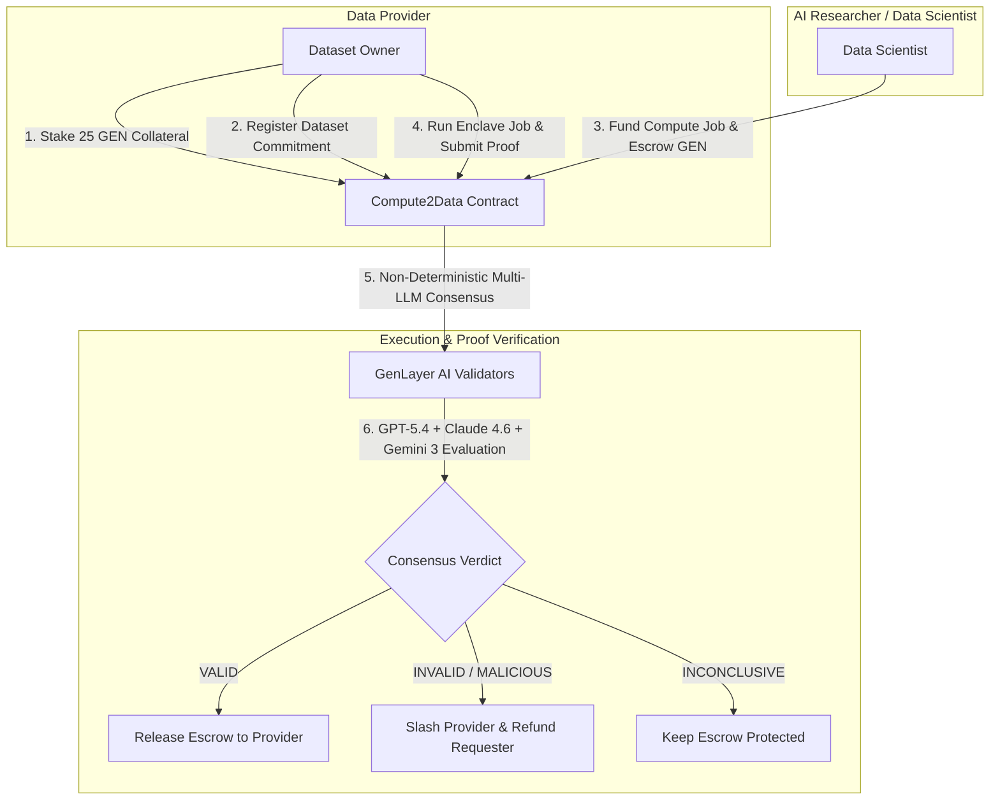

# Compute2Data: Autonomous Privacy-Preserving AI Compute Marketplace on GenLayer

<p align="center">
  
  
  
  
  
</p>

---

## 📌 Overview

**Compute2Data** is an intelligent, decentralized Compute-to-Data marketplace built natively on **GenLayer**. It solves the core dilemma of modern AI: **how can researchers train and validate models on private, high-value datasets without dataset owners exposing raw data or risking proprietary IP leaks?**

By leveraging **GenLayer Intelligent Contracts** and **Optimistic Democracy Multi-LLM Quorum Consensus**, Compute2Data allows data providers to lock collateral and publish cryptographically committed dataset schemas. Data scientists can fund compute jobs with automated **GEN token escrow**. When computation completes inside an isolated execution environment, GenLayer's AI validator quorum independently analyzes the execution proof against input/dataset commitments before unlocking escrow payouts or slashing dishonest providers.

---

## 🏛️ System Architecture



---

## ⛓️ On-Chain Deployment Specifications (GenLayer StudioNet)

| Parameter | Value |
| :--- | :--- |
| **Network** | `GenLayer StudioNet` (Gasless / AI Consensus) |
| **Contract Address** | `0xd1635bd866F6fd616Da1F1EBFFB686D9c01032F9` |
| **Deployment Tx Hash** | `0x0603acdc6e7f933e8c5e58bf0ce365c218dfd76086a1b90916b8065e8655b6bb` |
| **Consensus Status** | `MAJORITY_AGREE` (Accepted on-chain) |
| **Pinned Runner Hash** | `py-genlayer:1jb45aa8ynh2a9c9xn3b7qqh8sm5q93hwfp7jqmwsfhh8jpz09h6` |
| **Native Token** | `GEN` |

---

## 🚀 Key Features

1. **Deterministic Collateral & Bonding Rules:**
   - Providers must lock a minimum dataset bond (`10 GEN`) and job collateral (`2 GEN`) before registering datasets.
   - Prevents Sybil spam and guarantees funds for slashing in case of fabricated proofs.

2. **Decentralized Multi-LLM Quorum Verification:**
   - Evaluates proof metadata using `gl.vm.run_nondet_unsafe`.
   - AI validators compare output commitments against the original compute specification, dataset schema, and input hash.

3. **Autonomous Escrow Settlement:**
   - When proof passes validation (`VALID`), the contract credits the compute fee to the provider.
   - If a malicious proof is submitted (`INVALID`), the requester is refunded 100% of their escrow, and the provider's collateral is slashed.

4. **Next.js 14 Web3 Interface:**
   - Real-time dataset discovery, interactive compute request modal, provider console, and wallet management with automatic network switching (`Chain ID: 0x7a120`).

---

## 🧪 Testing & Validation

Compute2Data includes a comprehensive test suite covering all lifecycle states and edge cases:

```bash
# Run complete test suite and linter
./run_tests.sh
```

### Test Matrix

- `test_provider_must_stake_before_registering`: Verifies collateral bonding requirements.
- `test_listing_locks_bond_and_blocks_withdrawal`: Ensures active dataset bonds cannot be prematurely withdrawn.
- `test_successful_compute_releases_escrow_without_slashing`: Confirms automated escrow payout upon valid AI verification.
- `test_malicious_proof_refunds_requester_and_slashes_provider`: Validates slashing and refund mechanics for fraudulent proofs.
- `test_inconclusive_proof_keeps_funds_and_collateral_locked`: Verifies safe hold state when evidence is insufficient.
- `test_validator_reexecutes_and_compares_decision_fields`: Tests leader/validator non-deterministic consensus equivalence.
- `test_only_provider_can_submit_execution_proof`: Enforces access control on proof submissions.

---

## 💻 Local Development & Execution

### Prerequisites
- Node.js >= 18.x
- Python >= 3.10
- GenLayer CLI (`genvm-lint`, `genlayer`)

### 1. Install Dependencies
```bash
npm install
cd apps/web && npm install && cd ../..
```

### 2. Configure Environment
Create `.env.local` inside `apps/web/`:
```env
NEXT_PUBLIC_C2D_CONTRACT_ADDRESS=0xd1635bd866F6fd616Da1F1EBFFB686D9c01032F9
```

### 3. Run Web Application
```bash
cd apps/web
npm run dev
```
Open [http://localhost:3000](http://localhost:3000) in your browser.

---

## 📄 License & Attribution

- **Author & Architect:** [Saeid (@Handik4)](https://github.com/Handik4)
- **License:** MIT
- **Protocol:** Compute2Data on GenLayer
