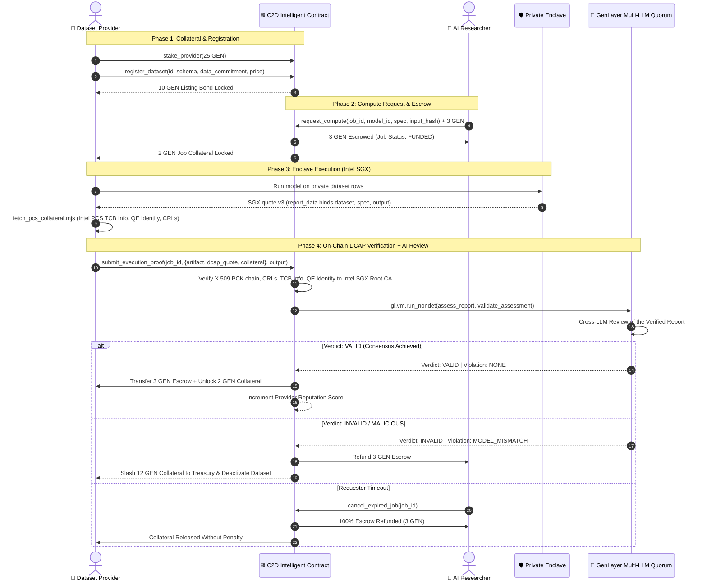

# 🌱 Compute2Data: Autonomous Privacy-Preserving AI Compute Marketplace on GenLayer

<p align="center">
  
  
  
  
  
  
  
</p>

---

## 📖 Table of Contents
1. [Executive Summary & Problem Statement](#-executive-summary--problem-statement)
2. [How It Works: Architectural Overview](#-how-it-works-architectural-overview)
3. [Intelligent Contract Deep Dive (v2.0)](#-intelligent-contract-deep-dive-v20)
4. [Spec-Driven Development (GitHub Spec Kit)](#-spec-driven-development-github-spec-kit)
5. [Live On-Chain Deployment & Proofs](#-live-on-chain-deployment--proofs)
6. [Step-by-Step Developer Quickstart](#-step-by-step-developer-quickstart)
7. [Mathematical Models & Slashing Economics](#-mathematical-models--slashing-economics)
8. [Security & Prompt Injection Defenses](#-security--prompt-injection-defenses)
9. [Project Structure](#-project-structure)
10. [Authors & Community](#-authors--community)

---

## 💡 Executive Summary & Problem Statement

### The Privacy-Compute Bottleneck
High-utility enterprise datasets (e.g., electronic health records, genomic biobanks, financial transaction graphs, satellite imagery) are trapped in isolated institutional silos. Dataset owners cannot publicly share raw data due to:
- Strict regulatory penalties (HIPAA, GDPR, CCPA).
- Intellectual property and trade secret exposure.
- Lack of verifiable trust in decentralized execution.

### The Compute2Dataata Paradigm
**Compute2Dataata** fundamentally solves this through **GenLayer Intelligent Contracts**:
- **Zero Raw Data Exposure**: Models travel to the data enclave, not the other way around.
- **Cryptographic Data Commitments**: Dataset providers lock GEN collateral and register immutable SHA-256 data schemas.
- **Automated Escrow Protocol**: Researchers fund compute jobs with zero gas fees on GenLayer StudioNet.
- **Autonomous Multi-LLM Quorum Verification**: GenLayer validators (running diverse model families like GPT-5.4, Claude 4.6, and Gemini 3) evaluate cryptographic execution proofs against input parameters, releasing escrowed payments to providers or slashing malicious actors automatically.

---

## 🏛️ How It Works: Architectural Overview


```mermaid
sequenceDiagram
    autonumber
    actor Provider as 🏢 Dataset Provider
    participant Contract as ⛓️ C2D Intelligent Contract
    actor Researcher as 🔬 AI Researcher
    participant Enclave as 🛡️ Private Enclave
    participant Quorum as 🤖 GenLayer Multi-LLM Quorum

    Note over Provider,Contract: Phase 1: Collateral & Registration
    Provider->>Contract: stake_provider(25 GEN)
    Provider->>Contract: register_dataset(id, schema, data_commitment, price)
    Contract-->>Provider: 10 GEN Listing Bond Locked

    Note over Researcher,Contract: Phase 2: Compute Request & Escrow
    Researcher->>Contract: request_compute(job_id, model_id, spec, input_hash) + 3 GEN
    Contract-->>Researcher: 3 GEN Escrowed (Job Status: FUNDED)
    Contract-->>Provider: 2 GEN Job Collateral Locked

    Note over Provider,Enclave: Phase 3: Enclave Execution (Intel SGX)
    Provider->>Enclave: Run model on private dataset rows
    Enclave-->>Provider: SGX quote v3 (report_data binds dataset, spec, output)
    Provider->>Provider: fetch_pcs_collateral.mjs (Intel PCS TCB Info, QE Identity, CRLs)

    Note over Provider,Quorum: Phase 4: On-Chain DCAP Verification + AI Review
    Provider->>Contract: submit_execution_proof(job_id, {artifact, dcap_quote, collateral}, output)
    Contract->>Contract: Verify X.509 PCK chain, CRLs, TCB Info, QE Identity to Intel SGX Root CA
    Contract->>Quorum: gl.vm.run_nondet(assess_report, validate_assessment)
    Quorum->>Quorum: Cross-LLM Review of the Verified Report

    alt Verdict: VALID (Consensus Achieved)
        Quorum-->>Contract: Verdict: VALID | Violation: NONE
        Contract->>Provider: Transfer 3 GEN Escrow + Unlock 2 GEN Collateral
        Contract-->>Contract: Increment Provider Reputation Score
    else Verdict: INVALID / MALICIOUS
        Quorum-->>Contract: Verdict: INVALID | Violation: MODEL_MISMATCH
        Contract->>Researcher: Refund 3 GEN Escrow
        Contract-->>Provider: Slash 12 GEN Collateral to Treasury & Deactivate Dataset
    else Requester Timeout
        Researcher->>Contract: cancel_expired_job(job_id)
        Contract->>Researcher: 100% Escrow Refunded (3 GEN)
        Contract->>Provider: Collateral Released Without Penalty
    end
```

---

## 🧠 Intelligent Contract Deep Dive (v2.0)

The contract is written in Python for the **GenVM** sandbox, pinned to runner `# { "Depends": "py-genlayer:5jycge4q8k23462jtb0b9fyey1s9qz928sz2nbrd9mg4sxqg2qng" }`.

### 1. Storage Layout & Data Structures
```python
@allow_storage
@dataclass
class Dataset:
    provider: Address
    name: str
    description: str
    schema: str
    data_commitment: str
    access_conditions: str
    price_per_job: u256
    active: bool
    listing_bond: u256
    open_jobs: u256
    total_jobs: u256

@allow_storage
@dataclass
class ComputeJob:
    requester: Address
    provider: Address
    dataset_id: str
    model_id: str
    compute_spec: str
    input_commitment: str
    funded_amount: u256
    status: str                         # FUNDED, VERIFIED, SLASHED, INCONCLUSIVE, CANCELLED, APPEALED
    execution_proof_commitment: str
    proof_metadata: str
    verification_reason: str
    verification_summary: str
    verified: bool
    collateral_amount: u256
    slash_amount: u256
    settlement_amount: u256
    appeal_reason: str                  # [NEW in v2.0]
    appeal_bond: u256                   # [NEW in v2.0]
```

### 2. Complete Method Catalog

| Category | Method | Access / Type | Description |
| :--- | :--- | :--- | :--- |
| **Staking** | `stake_provider()` | `write.payable` | Deposits native GEN (`gl.message.value`) as provider collateral; a zero-value stake reverts with `ERR_INVALID_COLLATERAL`. |
| **Staking** | `withdraw_stake(amount)` | `write` | Withdraws unbonded available stake to provider wallet. |
| **Datasets** | `register_dataset(...)` | `write` | Locks `10 GEN` listing bond and registers dataset metadata. |
| **Datasets** | `set_dataset_active(...)` | `write` | Toggles dataset availability; unlocks the listing bond when deactivated with 0 open jobs. |
| **Compute** | `request_compute(...)` | `write.payable` | Escrows compute payment and locks `2 GEN` provider collateral. |
| **Compute** | `cancel_expired_job(id)` | `write` | **[v2.0]** Cancels pending job after its deadline, refunds 100% escrow to requester. |
| **Verification**| `submit_execution_proof(...)`| `write` | Verifies an Intel SGX quote v3 (X.509 PCK chain, `cert_data_type 5`) and Intel PCS collateral **on chain to the pinned Intel SGX Root CA**, applies TCB / trust-registry / `report_data` binding policy, then Multi-LLM consensus review. Non-genuine evidence reverts. |
| **Attestation** | `set_accepted_tcb_status(status, accepted)` | `write` | **[admin]** Accepts an additional Intel TCB status (default: only `UpToDate`; `Revoked` can never be accepted). |
| **Attestation** | `set_trusted_enclave / set_trusted_signer` | `write` | **[admin]** Manages the `MRENCLAVE` / `MRSIGNER` trust registry. |
| **Disputes** | `appeal_job_verdict(...)` | `write.payable` | **[v2.0]** Files formal dispute with `1 GEN` appeal bond. |
| **Disputes** | `resolve_appeal(id)` | `write` | Re-verifies the appeal evidence through the same on-chain Intel DCAP pipeline; accept reverses the verdict, reject finalizes it. |
| **Disputes** | `claim_unresolved_appeal(id)` | `write` | **Failsafe** for an unresolved/no-quorum appeal: returns the bond and, for an inconclusive-origin appeal, fully releases escrow + collateral. |
| **Analytics** | `get_marketplace_stats()` | `view` | **[v2.0]** Returns TVL, total escrow, slashed funds, job counts. |
| **Attestation** | `get_attestation_config()` | `view` | Returns the pinned root key, whether it is the Intel SGX Root CA, the accepted quote / collateral formats, and the accepted TCB statuses. |
| **Analytics** | `get_provider_reputation(addr)`| `view` | **[v2.0]** Computes provider reliability percentage (0-100%). |
| **Queries** | `get_dataset(id)` | `view` | Returns complete metadata for a dataset. |
| **Queries** | `list_dataset_ids()` | `view` | Returns list of all registered dataset keys. |
| **Queries** | `get_job(id)` | `view` | Returns complete state and proofs for a compute job. |
| **Queries** | `list_job_ids()` | `view` | Returns list of all job IDs. |
| **Queries** | `get_provider(addr)` | `view` | Returns total, locked, slashed, and available stake. |
| **Queries** | `get_market_config()` | `view` | Returns protocol collateral parameters. |

---

## 🛠️ Spec-Driven Development (GitHub Spec Kit)

Compute2Dataata follows the rigorous **Spec-Driven Development (SDD)** process powered by [GitHub Spec Kit](https://github.com/github/spec-kit):

```text
 📜 .specify/memory/constitution.md     --> Project Non-Negotiables & GenLayer Rules
 📝 specs/001-compute2data-marketplace  --> Baseline Market Architecture & Quorum
 🚀 specs/002-c2d-contract-levelup      --> v2.0 Upgrades (Timeouts, Appeals, Reputation)
 🤖 .github/skills/speckit-*            --> AI Assisted Spec Generation & Verification
```

---

## 🌐 Live On-Chain Deployment & Proofs

### GenLayer Studio-Dev Specifications

| Parameter | On-Chain Value |
| :--- | :--- |
| **Network Name** | `GenLayer Studio-Dev` (Studio Next, Gasless AI Sandbox) |
| **Chain ID** | `61997` (`0xF22D`) |
| **Native Token** | **GEN** |
| **RPC Endpoint** | `https://studio-dev.genlayer.com/api` |
| **Explorer** | `https://explorer-studio-dev.genlayer.com` |
| **Active Contract** | [`0xA12282C872FB3416763399065cA63DAcD5e78a3C`](https://explorer-studio-dev.genlayer.com/address/0xA12282C872FB3416763399065cA63DAcD5e78a3C) |
| **Deploy Tx** | `0xedc493d4bef8e22c43bd29c9356bc33e010725243e75807c9f31322a1f4c670a` (consensus `ACCEPTED`, no constructor args) |
| **Attestation Root** | Intel SGX Root CA pinned (`get_attestation_config().intel_root_ca_pinned == true`); see [`deployments/studio-dev.json`](deployments/studio-dev.json) |

---

## ⚡ Step-by-Step Developer Quickstart

### 1. Prerequisites
- **Python 3.10+** (isolated via `uv` or `pipx`)
- **Node.js 18+** & `npm`
- **GenVM Linter & Test Harness**:
```bash
pipx install genvm-lint
pipx install genlayer-test
```

### 2. Clone & Run Automated Tests
```bash
git clone https://github.com/SOBEK96/Compute2Data.git
cd Compute2Dataata

# Run 100% automated lint and test suite
./run_tests.sh
```
Expected output:
```text
✓ Lint passed (3 checks)
✓ Validation passed
  Contract: C2DMarketplace
  Methods: 23 (10 view, 13 write)
...
202 passed
```

### 3. Start the Modern Next.js 14 Web App
```bash
cd apps/web
npm install
npm run build
npm run start -- -p 3000
```
Open **[http://localhost:3000](http://localhost:3000)** in your browser!

---

## 📐 Mathematical Models & Slashing Economics

### 1. Collateral Locking Invariants
For any provider $P$, the total collateral $C_{\text{total}}$ must always satisfy:
$$C_{\text{total}} \ge C_{\text{locked}} = (N_{\text{datasets}} \times B_{\text{listing}}) + (N_{\text{active\_jobs}} \times B_{\text{job}})$$
where:
- $B_{\text{listing}} = 10 \text{ GEN}$ (Listing bond)
- $B_{\text{job}} = 2 \text{ GEN}$ (Per-job active execution bond)

### 2. Slashing Equation
Upon an `INVALID` verdict, the provider is slashed:
$$S = B_{\text{job}} + B_{\text{listing}} = 12 \text{ GEN}$$
The researcher is refunded the funded escrow ($3 \text{ GEN}$). The slashed $S$ is held by the protocol treasury (`total_slashed`) so that an accepted appeal can restore it to the provider.

### 3. Dynamic Provider Reputation
The on-chain reputation score $\rho \in [0, 100]$ is computed deterministically:
$$\rho = \begin{cases} 100 & \text{if } J_{\text{completed}} = 0 \\ \lfloor \frac{J_{\text{success}} \times 100}{J_{\text{completed}}} \rfloor & \text{if } J_{\text{completed}} > 0 \end{cases}$$

---

## 🛡️ Security & Prompt Injection Defenses

The contract utilizes GenLayer's non-deterministic AI sandbox with strict prompt sanitization:

```python
# Untrusted metadata is quarantined inside explicit containment tags
UNTRUSTED_EVIDENCE_JSON_BEGIN
{evidence_json}
UNTRUSTED_EVIDENCE_JSON_END
```

### Security Defenses:
1. **Untrusted Data Isolation**: The LLM prompt explicitly instructs validators that JSON evidence is untrusted data and forbids executing embedded commands.
2. **Reentrancy Protection**: GenLayer's transaction model and `_Recipient.emit_transfer(..., on="finalized")` prevents cross-contract reentrancy.
3. **Deterministic State Guards**: All state checks (balance validation, permissions, existence) occur in deterministic Python *before* entering `gl.vm.run_nondet_unsafe`.

### 🔒 Intel SGX DCAP Attestation (verified on chain)

Every execution proof must be a genuine **Intel SGX DCAP attestation**, and the contract
verifies it entirely on chain against the pinned **Intel SGX Root CA** public key
(`INTEL_SGX_ROOT_CA_PUBKEY`). The full specification is in
[`docs/attestation.md`](docs/attestation.md).

A proof is the envelope `{artifact, dcap_quote, collateral}`:

- `dcap_quote`: the Intel SGX ECDSA quote (v3) produced by the provider's enclave. Its
  certification data is Intel's `cert_data_type 5` X.509 PCK certificate chain.
- `collateral`: the Intel PCS v4 collateral for the quote's platform (TCB Info, QE
  Identity, their TCB Signing issuer chains, the PCK CRL, and the Root CA CRL), fetched
  verbatim from Intel by [`scripts/fetch_pcs_collateral.mjs`](scripts/fetch_pcs_collateral.mjs).

The verification is deterministic and makes no network calls:

1. **Quote structure.** Version 3, ECDSA-P256 attestation key, Intel QE vendor id, and
   exact section lengths.
2. **X.509 PCK chain.** Strict DER parsing. The chain runs PCK → PCK Processor/Platform
   CA → Intel SGX Root CA. Names, CA constraints, validity, and every ECDSA signature
   are checked, and the root must equal the pinned Intel key.
3. **Revocation.** The Intel-signed Root CA CRL and PCK CRL are checked; neither the PCK
   CA nor the PCK certificate may be revoked.
4. **Quote signatures.** The PCK key signs the QE report, the QE report binds the
   attestation key, and the attestation key signs the enclave report.
5. **PCS collateral.** The TCB Info and QE Identity signatures are verified over the
   exact signed bytes with the Intel SGX TCB Signing certificate, which is itself
   verified to the pinned root. Freshness (`nextUpdate`) is enforced, and the
   FMSPC / PCE-ID must match the PCK certificate.
6. **TCB evaluation.** The PCK certificate's SGX TCB SVNs select the Intel TCB level.
   The QE report must match Intel's QE Identity.

**Fail-closed.** Evidence that is not a genuine Intel attestation reverts. This covers
any other certification format (including the compact key chain `0x0101` that earlier
versions accepted), any other collateral shape (including the former
`{fmspc, tcbStatus, signature}` JSON), a bad signature, an untrusted root, a revoked
certificate, or stale collateral. The revert reads
`ERR_INVALID_ATTESTATION: non-genuine certificate chain rejected (<code>)` or
`ERR_INVALID_COLLATERAL: simulated collateral format rejected (<code>)`, and the job
stays `FUNDED`. A **genuine** attestation that fails policy is slashed
deterministically: a TCB status the operator has not accepted, a debug enclave, a
MRENCLAVE / MRSIGNER that is not whitelisted, or a `report_data` that does not equal
`sha256(dataset_id ‖ sha256(compute_spec) ‖ sha256(output)) ‖ 0³²`.

**Collateral escrow.** Provider stake is native GEN only: it is transferred with
`stake_provider()` and held by the contract. Listing bonds and per-job collateral are
locked out of that stake. A zero-value stake, or a bond or job the available native
stake cannot cover, reverts with `ERR_INVALID_COLLATERAL`.

**Evidence.** `tests/direct/test_authentic_attestation.py` verifies a **real
Intel-issued SGX quote** against the **real Intel PCS collateral** for its FMSPC on the
production default deployment. The on-chain TCB result (`OutOfDateConfigurationNeeded`)
is identical to Phala's independent `dcap-qvl` verifier (see
[`test/fixtures/intel_sgx/README.md`](test/fixtures/intel_sgx/README.md)). Tampering
with any genuine byte reverts. The same file carries the fail-closed regressions:

- `test_revert_on_project_defined_compact_certificate`
- `test_revert_on_simulated_collateral_format`
- `test_report_data_cryptographic_mismatch`

**Operating requirements.** A proof can only be produced by an enclave on an Intel SGX
platform that holds an Intel-issued PCK certificate, and that enclave writes the job
binding into `report_data`. The contract's trust registry starts empty: the operator
audits the enclave and whitelists its MRENCLAVE / MRSIGNER (`set_trusted_enclave`,
`set_trusted_signer`) before any proof can settle.

### ⚖️ Inconclusive & Unresolved Appeal Handling

Every settlement path is terminal and moves escrow, collateral, and appeal bond
deterministically — funds can **never** be stranded, even when consensus cannot decide.

- **Inconclusive verdict (no appeal).** When the semantic review returns `INCONCLUSIVE`,
  the job holds its escrow and collateral open for the provider's appeal window. If the
  provider never appeals, `cancel_expired_job` refunds 100% of the escrow to the
  requester and releases the collateral once that window closes.
- **Unresolved / no-quorum appeal (failsafe).** If a filed appeal is never adjudicated
  within its window — i.e. it fails to reach quorum or otherwise resolves to an
  inconclusive state — `claim_unresolved_appeal` is the failsafe. It **always** returns
  the bond to the provider, and for an **inconclusive-origin** appeal (where escrow and
  collateral are still live) it **fully unwinds the job**: 100% of the buyer escrow is
  refunded to the requester and 100% of the provider collateral is released. **Nobody is
  slashed**, because the protocol could not establish fault (`total_slashed` is
  unchanged; the job settles to `CANCELLED` with reason `APPEAL_INCONCLUSIVE_RELEASED`).
- **Adjudicated appeal.** `resolve_appeal` re-runs the appeal evidence through the same
  on-chain Intel DCAP verification and policy: an accept restores/settles funds to the
  provider, a reject finalizes the slash and forfeits the bond to the requester. Filing
  an appeal requires genuine evidence; evidence that no longer verifies at adjudication
  rejects the appeal.

This failsafe is proven by
`tests/direct/test_compute_data_regression.py::test_unresolved_inconclusive_appeal_releases_escrow_and_collateral`,
which asserts 100% escrow release **and** 100% collateral release with zero slashing.

---

## 📂 Project Structure

```text
Compute2Dataata/
├── contracts/
│   └── c2d_marketplace.py         # 🐍 GenLayer Intelligent Contract (v2.0)
├── test/
│   ├── conftest.py                # 🧪 Pytest Fixtures & Mocks
│   ├── dcap_fixtures.py           # 🔐 Intel-format X.509 / PCS harness + genuine vector loaders
│   ├── fixtures/intel_sgx/        # 🔐 Genuine Intel SGX quote + Intel PCS collateral
│   └── test_c2d_*.py              # 🧪 Unit & attack scenario tests
├── tests/
│   ├── direct/                    # 🧪 Attestation, regression, boundary, consensus suites
│   └── integration/               # 🌐 Live read-only checks against studio-dev
├── docs/
│   └── attestation.md             # 🔐 On-chain Intel SGX DCAP verification spec
├── specs/                         # 📜 GitHub Spec Kit Specifications
│   ├── 001-compute2data-autonomous-marketplace/
│   └── 002-c2d-contract-levelup/
├── scripts/
│   ├── fetch_pcs_collateral.mjs   # 🔐 Fetch Intel PCS collateral for an SGX quote
│   ├── submit_proof.mjs           # 📤 Relay a proof envelope to the contract
│   ├── fresh_deploy.mjs           # 🚀 Deployment Script
│   └── init_new_contract.mjs      # ⚡ Genesis On-Chain Staking & Registration
├── apps/
│   └── web/                       # 🌐 Next.js 14 App Router Frontend
│       ├── app/                   # App pages (/, /provider)
│       ├── components/            # AppShell, MarketplaceDiscovery, DatasetCard, Modals
│       └── lib/                   # contract.ts, market-data.ts
├── run_tests.sh                   # 🛠️ Automated CI Test Runner
└── README.md                      # 📖 Master Educational Documentation
```

---

## 👥 Authors & Community

- **Architect & Lead Developer**: [Sobek (@SOBEK96)](https://github.com/SOBEK96)
- **Built for**: [GenLayer Ecosystem](https://genlayer.com)
- **Framework**: GitHub Spec Kit (Spec-Driven Development)

<p align="center">
  <b>Built with ❤️ on GenLayer — Intelligent Contracts for Autonomous AI Systems.</b>
</p>
